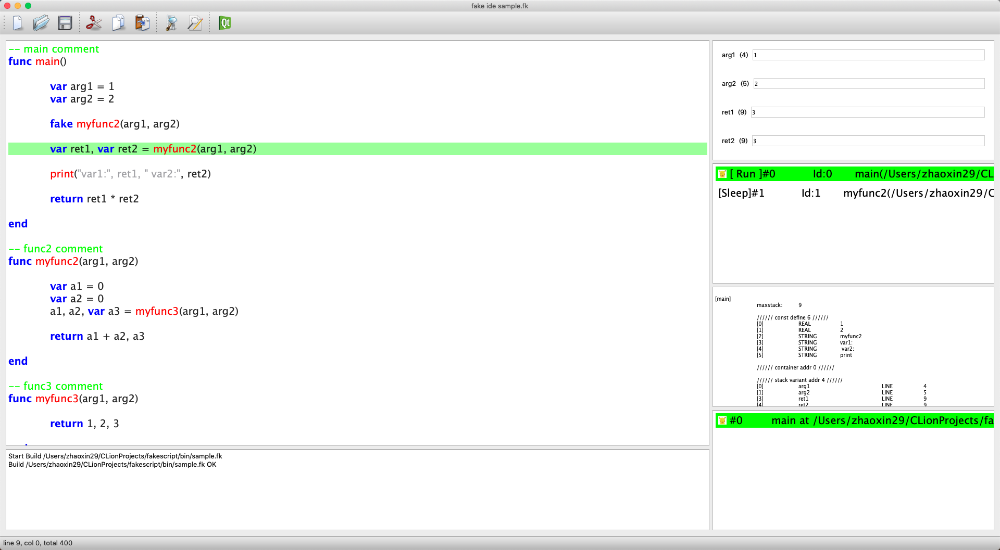
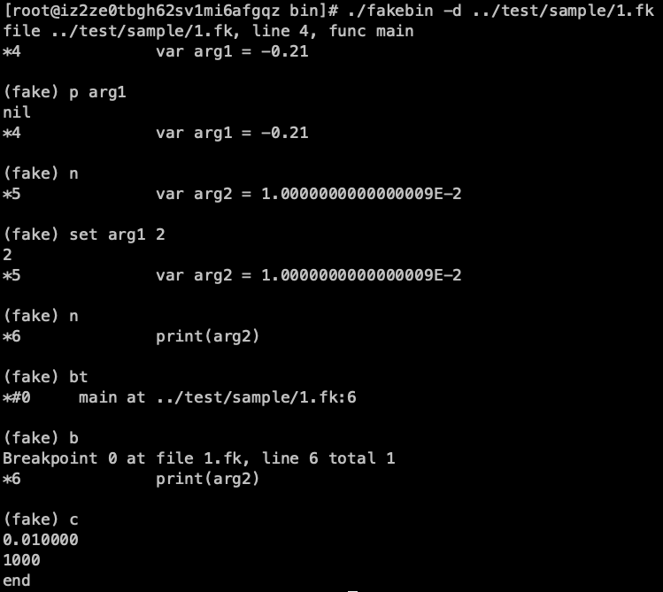

# fake

[](https://github.com/esrrhs/fake) [](https://github.com/esrrhs/fake)[](https://github.com/esrrhs/fake) [](LICENSE)

Lightweight embedded scripting language

## Brief introduction
**fake** is a lightweight embedded scripting language , using c ++ language, grammar lessons from lua, golang, erlang, based on flex, bison generative grammar tree , compiled into byte code interpreted. 

## Script feature
* Operating environment linux amd64, MacOS amd64
* Support VM, JIT(Experimental nature)
* Support fake testfunc (param1) to generate routine, achieve multi-threading effect on a single thread (this feature does not support JIT)
* Support debugging, self-contained gdb-style command line debugger, and VS-style visual editing debug ide, can also be called directly in the C through the interface, start command line debugging
* Support for hot updates
* Support for binding of C-style functions and C++ class member functions
* Support profile, can get the running time of each function of the script
* Support array, map, can be nested infinitely
* Support multiple return values
* Support Int64
* Support const definition
* Support package
* Support struct
* Support for packaging bin files or executable files


## In Production
[疯狂炸翻天](https://www.muzhiwan.com/com.fkzft.gamewin.mzw.html)
[我是大主宰](http://dzz.youxi.com)
[天天炫斗](http://ttxd.qq.com/act/a20160419brandP/)

## Sample

```


-- Current package name
package mypackage.test

-- include file
include "common.fk"

-- struct define
struct teststruct
	sample_a
	sample_b
	sample_c
end

-- const define
const hellostring = "hello"
const helloint = 1234
const hellomap = {1 : "a" 2 : "b" 3 : [1 2 3]}

-- func1 comment
func myfunc1(arg1, arg2)
	
	-- C function calls and class member functions
	arg3 := cfunc1(helloint) + arg2:memfunc1(arg1)
	
	-- Branch
	if arg1 < arg2 then	
		-- create routine
		fake myfunc2(arg1, arg2)
	elseif arg1 == arg2 then	
		print("elseif")
	else
		print("else")
	end
	
	-- for loop
	for var i = 0, i < arg2, i++ then
		print("i = ", i)
	end
	
	-- array use
	var a = array()
	a[1] = 3
	
	-- map use
	var b = map()
	b[a] = 1
	b[1] = a
	
	-- Int64
	var uid = 1241515236123614u
	log("uid = ", uid)

	-- sub func call
	var ret1, var ret2 = myfunc2()

	-- other package call
	ret1 = otherpackage.test.myfunc1(arg1, arg2)
	
	-- struct use
	var tt = teststruct()
	tt->sample_a = 1
	tt->sample_b = teststruct()
	tt->sample_b->sample_a = 10

	-- switch branch
	switch arg1
		case 1 then
			print("1")
		case "a" then
			print("a")
		default
			print("default")
	end

	-- multi return value
	return arg1, arg3
	
end
```

## C++ Sample

```
// create instance
fake * fk = newfake();
// regist global func
fkreg(fk, "cfunc1", cfunc1);
// regist class mem func, diffent class type can regist the same name
fkreg(fk, "memfunc1", &class1::memfunc1);
// parse script file
fkparse(fk, argv[1]);
// run script func myfunc1, put in two param 1 and 2
ret = fkrun<int>(fk, "myfunc1", 1, 2);
// delete instance
delfake(fk);
```

## Performance comparison
Data on the MacBook Pro 2.3 GHz Intel Core i5

|       | Lua   | Python |  Fake | Fake JIT |
|-------|-------|:------:|------:|----------|
| Loop  | 0.8s  |  2.3s  |  2.1s | 0.2s     |
| Prime | 13.5s |  20.9s | 16.9s | 5.9s     |


## How to use
copy include/**fake-inc.h** and bin/**libfake.so** to your project

## How to compile
1. Install cmake
2. (Optional) Install flex, bison, run ```./gen.sh```
3. Install gcc, gcc-c++
4. ```./build.sh``` or ```./build.sh release```

## Debugging environment
* IDE



* Command-line


